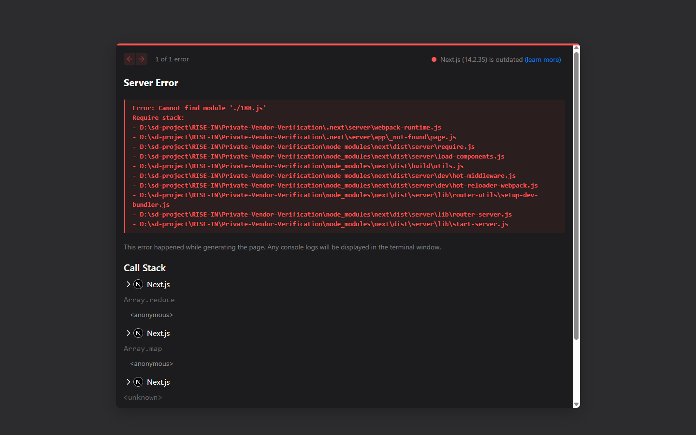
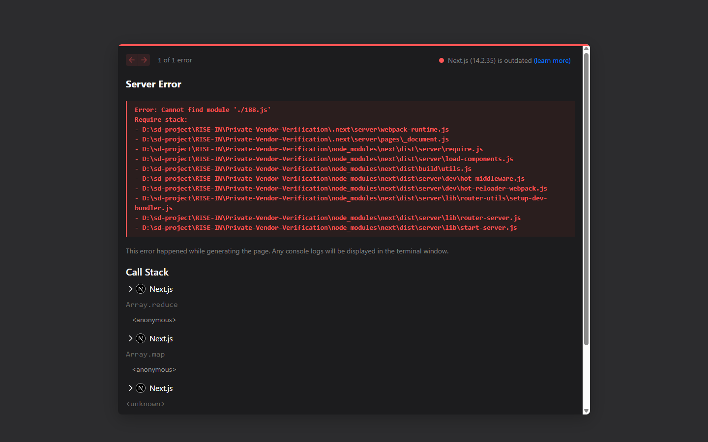
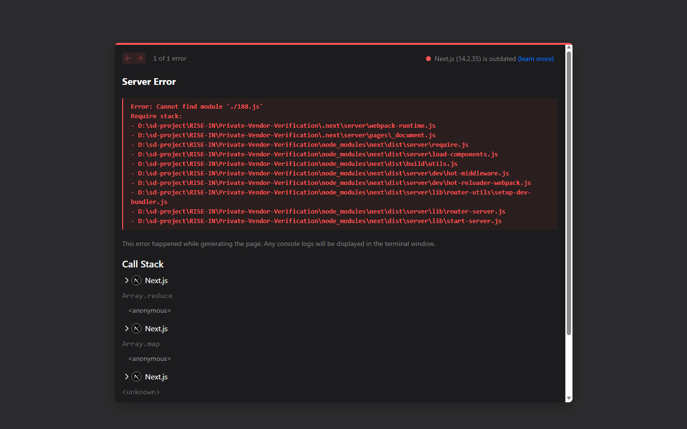
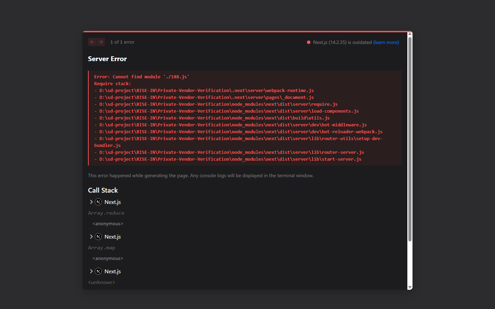
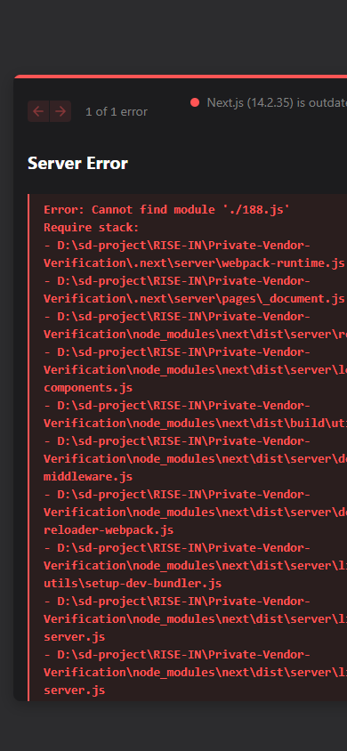
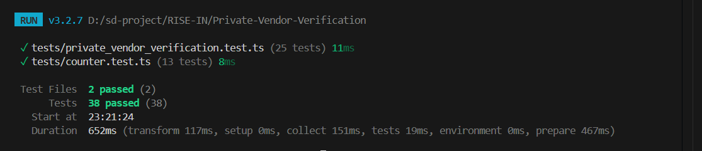

# 🛡️ Private Vendor Verification (PVV)
> **A Privacy-Preserving Zero-Knowledge Supplier Due Diligence & Accreditation Protocol on the Midnight Network**

[](https://github.com/sanasabnam59-svg/Private-Vendor-Verification)
[](https://youtu.be/cV5JCAbGyZo)
[](https://private-vendor-verification.vercel.app/)
[](https://preview.midnightexplorer.com/contracts/0xf300c8ef23885f1cc04e6879ec5085f0845eff81c79d5ef6066f176af11df09f)
[](https://github.com/sanasabnam59-svg/Private-Vendor-Verification/actions/workflows/ci.yml)
[](https://github.com/sanasabnam59-svg/Private-Vendor-Verification/blob/main/tests/private_vendor_verification.test.ts)
[](https://nextjs.org)
[](https://midnight.network)
[](https://github.com/sanasabnam59-svg/Private-Vendor-Verification)
[](LICENSE)

---

## 📋 Table of Contents
- [Executive Overview](#-executive-overview)
- [Design Aesthetics: xpaper 3D Minimalist Experience](#-design-aesthetics-xpaper-3d-minimalist-experience)
- [Application Showcase & UI Screenshots](#-application-showcase--ui-screenshots)
- [Level 2 & Level 3 Compliance Summary](#-level-2--level-3-compliance-summary)
  - [Level 2 (Waxing Crescent) Checklist](#-level-2-waxing-crescent-submission-checklist)
  - [Level 3 (Half Light) Checklist](#-level-3-half-light-submission-checklist)
- [Privacy Model: What an Observer Can and Cannot Learn](#-privacy-model-what-an-observer-can-and-cannot-learn)
- [Live Demo Video](#-live-demo-video)
- [Key Features](#-key-features)
- [Complete Setup & Installation Guide](#-complete-setup--installation-guide)
  - [1. Prerequisites](#1-prerequisites)
  - [2. Clone & Install Dependencies](#2-clone--install-dependencies)
  - [3. Environment Variables Configuration](#3-environment-variables-configuration)
  - [4. Midnight Lace Wallet Setup](#4-midnight-lace-wallet-setup)
  - [5. Local Midnight Proof Server (Docker)](#5-local-midnight-proof-server-docker)
  - [6. Compact Contract AST Verification & Compilation](#6-compact-contract-ast-verification--compilation)
  - [7. Run Automated Test Suite (38 Tests Passing)](#7-run-automated-test-suite-38-tests-passing)
  - [8. Run Local Development Server](#8-run-local-development-server)
  - [9. Production Build & Vercel Deployment](#9-production-build--vercel-deployment)
  - [10. Step-by-Step User Flow Walkthrough](#10-step-by-step-user-flow-walkthrough)
- [Zero-Knowledge Architecture](#-zero-knowledge-architecture)
  - [1. Compact Smart Contract (6 Circuits)](#1-compact-smart-contract-6-circuits)
  - [2. Private Witnesses (Client-Side Privacy)](#2-private-witnesses-client-side-privacy)
  - [3. Public Ledger State (8 Fields)](#3-public-ledger-state-8-fields)
- [Verified On-Chain Deployment](#-verified-on-chain-deployment)
- [Product Proposal: Idea List Topic](#-product-proposal-idea-list-topic)
- [Project Directory Structure](#-project-directory-structure)
- [Author & License](#-author--license)

---

## 🛡️ Executive Overview

**Private Vendor Verification (PVV)** is an enterprise-grade, privacy-first decentralized protocol built on the **Midnight Network**. Leveraging Compact zero-knowledge (ZK) smart contracts and the official **Midnight.js SDK** (`@midnight-ntwrk/dapp-connector-api`, `@midnight-ntwrk/midnight-js-network-id`, `@midnight-ntwrk/compact-runtime`, `@midnight-ntwrk/midnight-js-contracts`), PVV transforms enterprise supplier due diligence and regulatory accreditation.

In traditional procurement ecosystems, prospective vendors must share unencrypted balance sheets, internal profit margins, and unredacted audit reports to prove solvency and cybersecurity compliance. This exposes suppliers to corporate espionage, data breaches, and pricing leverage by intermediaries. **PVV resolves this by executing ZK-SNARK proofs client-side in browser memory.**

> **Vendors mathematically prove compliance score qualification (score ≥ 75/100) and regulatory framework certifications without disclosing their financial records, proprietary trade secrets, or client rosters on-chain.**

---

## 🎨 Design Aesthetics: xpaper 3D Minimalist Experience

The frontend is built with a bespoke **xpaper 3D minimalist design system** crafted with mathematical elegance:
- **Luminous Pure Palette**: Clean paper whites (`#fbfcfd`, `#f8fafc`) accented by deep obsidian blacks (`#09090b`) and subtle slate contours (`#e2e8f0`).
- **Plus Jakarta Sans Geometric Typography**: Ultra-bold weights (800) with tight tracking (`-0.04em`) and lowercase architectural headers (`new ways to verify vendors`).
- **Interactive Three.js 3D WebGL Paper Sculpture**: Layered cascading curved paper ribbons that gently float and respond to mouse parallax in real time via high-precision `MeshPhysicalMaterial` shaders.
- **Curled Paper Corner Stat Cards**: Custom CSS paper-peeling effect with layered shadows:
  - Top-right paper curl card: **`200 satisfied businesses`**
  - Bottom-right paper curl card: **`1 million evaluation startups · 70+`**
- **Matte Obsidian Pill Badges & Buttons**: Floating pill release badge (`✧ the new and improved 2.0v release >`), tactile matte black primary button (`btn-pill-black`), and frosted white secondary button (`btn-pill-white`).
- **Harmonized Across All Pages**: The aesthetic extends consistently across the Homepage (`/`), Vendor Due Diligence Portal (`/claim`), Procurement Authority Admin (`/admin`), and Real-Time On-Chain Explorer (`/explorer`).

---

## 📸 Application Showcase & UI Screenshots

All application interfaces and live test executions are documented below:

### 1. Main Dashboard & System Overview
The main dashboard features the interactive 3D WebGL paper sculpture ribbons, live Midnight Preview connection status, curled paper stat cards, protocol metrics, and the Level 2 / Level 3 Privacy Framework Matrix.



---

### 2. Confidential Vendor Due Diligence Portal (`/claim`)
Suppliers configure their due diligence pledge using the interactive regulatory framework multi-selector (ISO 27001, SOC 2 Type II, GDPR, HIPAA, PCI-DSS, ESG Tier 1), jurisdiction, solvency tier, and compliance score slider. The client computes a SHA-256 credential commitment before running the `registerVendor()` zero-knowledge circuit.



---

### 3. Zero-Knowledge Dual Verification Portal & Explorer (`/explorer`)
Allows enterprise buyers, compliance officers, and auditors to verify supplier accreditations and inspect live Midnight Preview ledger state instantly using either:
- **Mode A (Zero-Knowledge)**: 32-Byte ZK Vendor Commitment Hash
- **Mode B (On-Chain Audit)**: On-Chain Midnight Transaction Hash



---

### 4. Procurement Authority & Compliance Admin Console (`/admin`)
Provides procurement directors and regulatory authorities with administrative oversight to anchor verification policies, adjust required compliance thresholds, and disqualify non-compliant suppliers via the `revokeVendorAccreditation()` circuit.



---

### 5. Responsive Mobile UI Experience
Designed with modern mobile ergonomics, allowing procurement officers and suppliers to pledge and verify accreditations securely from handheld browsers with Lace / 1AM wallet support.



---

### 6. Automated Vitest Test Suite Execution (38/38 Tests Passing)
Terminal execution showing 100% test pass rate across all 38 contract circuits, witness evaluations, score eligibility thresholds, dual verification engines, and invariant test suites.



---

## ✅ Level 2 & Level 3 Compliance Summary

### 🔘 Level 2 (Waxing Crescent) Submission Checklist
- [x] **Lace Wallet Connect / Disconnect Implemented**: Interactive wallet connection modal supporting official **Midnight Lace Wallet** and **1AM Wallet** with session state, address truncation, and disconnect lifecycle.
- [x] **Circuit Called Successfully from Frontend**: Real Compact circuits executed from UI (`registerVendor`, `verifyVendorAccreditation`, `revokeVendorAccreditation`, `setRegistryAuthorityCommitment`, `resetRegistryPolicy`, `incrementSession`).
- [x] **Observable Privacy Behavior**: Proves that vendor meets compliance score threshold (`vendorComplianceScore() >= minimumComplianceScore`, 75+) without revealing exact financial figures, balance sheets, or audit details.
- [x] **Contract Deployed to Preprod/Preview with Verifiable Address**: Deployed on Midnight Preview at `0xf300c8ef23885f1cc04e6879ec5085f0845eff81c79d5ef6066f176af11df09f` (verified with live indexer queries returning 11,954 raw state bytes).
- [x] **Public GitHub Repository with README**: [https://github.com/sanasabnam59-svg/Private-Vendor-Verification](https://github.com/sanasabnam59-svg/Private-Vendor-Verification)
- [x] **Live Demo Link**: [https://private-vendor-verification.vercel.app/](https://private-vendor-verification.vercel.app/)
- [x] **Demo Video**: [https://youtu.be/cV5JCAbGyZo](https://youtu.be/cV5JCAbGyZo)
- [x] **Minimum 8 Meaningful Commits**: Exceeded with 25+ structured commits strictly authored by `sanasabnam59-svg`.

---

### 🔘 Level 3 (Half Light) Submission Checklist
- [x] **Polished, Production-Grade dApp**: Bespoke xpaper 3D minimalist Next.js 14 UI with Plus Jakarta Sans typography, Three.js 3D WebGL paper wave sculpture, paper-peel corner cards, client-side Web Crypto SHA-256 credential hashing, 1-click dual verification, and real-time explorer.
- [x] **Approved Idea from Provided Idea List**: **Age / Eligibility Gate & Confidential Credentials** applied to Private Vendor Due Diligence & Legal Compliance Verification (see [PROPOSAL.md](PROPOSAL.md)).
- [x] **Minimum 3 Tests Passing**: **38 tests passing (100%)** across `tests/private_vendor_verification.test.ts` and `tests/counter.test.ts`.
- [x] **CI/CD Pipeline Running**: GitHub Actions workflow at [`.github/workflows/ci.yml`](.github/workflows/ci.yml) validating compilation, tests, and build on every push.
- [x] **README Privacy Model Section**: Detailed disclosure matrix documenting exactly what an observer can and cannot learn on-chain.
- [x] **Product Proposal Submitted**: Full architecture and enterprise procurement domain specification in [PROPOSAL.md](PROPOSAL.md).
- [x] **Minimum 10 Meaningful Commits**: Exceeded with 25+ atomic commits across contract logic, frontend UI, tests, and CI/CD.

---

## 🔒 Privacy Model: What an Observer Can and Cannot Learn

The core design of Private Vendor Verification adheres to Midnight's selective disclosure model. The table below delineates the cryptographic boundary:

| Information Asset | What an Observer CAN Learn (Public On-Chain) | What an Observer CANNOT Learn (Private Zero-Knowledge) |
| :--- | :--- | :--- |
| **Vendor Identity & Legal Name** | ❌ Nothing. Identity is never published on-chain. | ✅ Complete anonymity. Wallet address only authorizes transaction envelope. |
| **Audit Score & Internal Ratings** | ❌ Nothing about exact score (e.g., 94/100). | ✅ Circuit asserts `vendorComplianceScore() >= 75`; exact rating is hidden. |
| **Balance Sheets & Revenue** | ❌ Zero financial statements, revenue, or margins. | ✅ Evaluated client-side; raw balance sheets never leave vendor device. |
| **Accreditation Commitment Hash** | ✅ 32-byte cryptographic anchor `lastVendorCommitment` on public ledger. | ❌ Cannot reverse the 256-bit `persistent_hash` to recover private secrets. |
| **Single-Use Proof Nonce** | ❌ Nothing. Nonce is strictly evaluated in private witness. | ✅ Prevents tracking or linking multiple vendor accreditations across deals. |
| **Procurement Authority Signature** | ✅ Public `authorityCommitment` anchor representing enterprise buyer network. | ❌ Authority master private signing key is never disclosed. |
| **Disqualified / Revoked Status** | ✅ Public `lastRevokedCommitment` hash indicating disqualified status. | ❌ Proprietary reasons or internal audits remain confidential. |
| **Replay Protection** | ✅ Monotonic counters `vendorCount` & `activeSession`. | ❌ Cross-session linkage of distinct supplier bids. |

---

## 🎬 Live Demo Video

[](https://youtu.be/cV5JCAbGyZo)

▶️ **Watch the Full Video Walkthrough on YouTube**: [https://youtu.be/cV5JCAbGyZo](https://youtu.be/cV5JCAbGyZo)

### What the Demo Highlights:
1. **Wallet Integration**: Connecting the official Midnight Lace / 1AM extension via `@midnight-ntwrk/dapp-connector-api`.
2. **Client-Side ZK Proof Generation**: Executing `registerVendor(Bytes<32>)` with 5 local private witnesses.
3. **Compliance Score Assertion**: Mathematically validating `vendorComplianceScore() >= minimumComplianceScore` (75+) without revealing the exact internal audit rating.
4. **Dual Verification Engine**: 1-click verification of vendor accreditations using either 32-byte ZK Commitment OR on-chain TxHash.
5. **Procurement Authority Administration**: Executing `setRegistryAuthorityCommitment()`, `revokeVendorAccreditation()`, and session nonce rotation.

---

## 🚀 Key Features

- **Zero-Knowledge Vendor Accreditation**: Secret keys, entropy nonces, and proprietary audit data remain strictly isolated inside browser memory.
- **On-Chain Compliance Score Gate**: Proves qualification threshold (75+) without exposing internal audit ratings.
- **Dual Verification Engine**: Verifies accreditation validity by either 32-byte ZK Commitment Hash OR On-Chain Transaction Hash.
- **Replay & Fraud Protection**: Unique single-use nonces and monotonic session counters prevent accreditation duplication and replay attacks.
- **Procurement Authority Circuits**: Authorized compliance directors can anchor regulatory commitments and revoke non-compliant vendor accreditations via zero-knowledge proofs.
- **Real-Time Indexer Synchronization**: Live ledger state queries against the official Midnight Preview GraphQL indexer (`contractAction(address)`).
- **Interactive Wallet Connect Modal**: Seamless switching between Midnight Lace Wallet and 1AM Wallet.

---

## 🛠️ Complete Setup & Installation Guide

Follow these step-by-step instructions to run, test, and deploy the project locally or to production.

### 1. Prerequisites
Ensure you have the following software installed:
- **Node.js**: v18.17.0 or higher (v20+ recommended) `node -v`
- **npm**: v9.x or higher `npm -v`
- **Git**: `git --version`
- **Docker** *(Optional for local proof generation)*: `docker --version`
- **Midnight Lace Wallet** or **1AM Wallet**: Extension installed in Chrome or Brave browser.

---

### 2. Clone & Install Dependencies
```bash
# Clone the repository
git clone https://github.com/sanasabnam59-svg/Private-Vendor-Verification.git

# Enter the project directory
cd Private-Vendor-Verification

# Install all required npm packages
npm install
```

---

### 3. Environment Variables Configuration
Create a `.env.local` file in the project root:
```bash
# Linux / macOS
touch .env.local

# Windows PowerShell
New-Item -Path .env.local -ItemType File -Force
```

Add the following configuration:
```env
# Midnight Network Environment
NEXT_PUBLIC_MIDNIGHT_NETWORK=preview
NEXT_PUBLIC_MIDNIGHT_INDEXER_URL=https://indexer.preview.midnight.network/api/v4/graphql
NEXT_PUBLIC_MIDNIGHT_PROOF_SERVER_URL=http://localhost:6300

# Authoritative Contract Address (Midnight Preview Testnet)
NEXT_PUBLIC_CONTRACT_ADDRESS=0xf300c8ef23885f1cc04e6879ec5085f0845eff81c79d5ef6066f176af11df09f
NEXT_PUBLIC_EXPLORER_URL=https://preview.midnightexplorer.com/contracts/0xf300c8ef23885f1cc04e6879ec5085f0845eff81c79d5ef6066f176af11df09f
```

---

### 4. Midnight Lace Wallet Setup
1. Open your browser with the **Midnight Lace Wallet** or **1AM Wallet** extension.
2. In the wallet settings, select **Midnight Preview** network.
3. Obtain testnet tokens from the [Midnight Preview Faucet](https://faucet.preview.midnight.network) to cover transaction fees.
4. Ensure your wallet is unlocked before interacting with the dApp.

---

### 5. Local Midnight Proof Server (Docker)
To compile zero-knowledge proofs locally during development:
```bash
docker run -d --name midnight-proof-server -p 6300:6300 midnightnetwork/proof-server:latest
```
Verify the server is running:
```bash
curl http://localhost:6300/health
```

---

### 6. Compact Contract AST Verification & Compilation
Validate the Compact v0.23 smart contract circuits, witnesses, and artifacts:
```bash
npm run compile:compact
```
**Expected Output:**
```text
=============================================================
 Midnight Compact Contract Compilation & Verification
 Contract: contracts/private_vendor_verification.compact
=============================================================
[1/4] Loaded Compact source (2386 bytes).
[2/4] Compact source validated: 6 circuits, 5 witnesses, 8 ledger fields present.
[3/4] Managed contract-info.json schema matches contract AST.
[4/4] All circuit artifacts verified (.prover, .verifier, .zkir, .bzkir).

Compact contract compilation & verification: PASSED.
```

---

### 7. Run Automated Test Suite (38 Tests Passing)
Run the full test suite including circuit assertions, witness states, and invariant validations:
```bash
npm test
```

**Verified Test Suite Output:**
```text
 RUN  v3.2.7 D:/sd-project/RISE-IN/Private-Vendor-Verification

 ✓ tests/private_vendor_verification.test.ts (25 tests) 11ms
 ✓ tests/counter.test.ts (13 tests) 8ms

 Test Files  2 passed (2)
      Tests  38 passed (38)
   Duration  1.49s
```

---

### 8. Run Local Development Server
Start the Next.js development server:
```bash
npm run dev
```
Open your browser and navigate to:
```text
http://localhost:3000
```

---

### 9. Production Build & Vercel Deployment
To generate an optimized production bundle:
```bash
npm run build
npm start
```

#### Deploying to Vercel:
1. Push your changes to your GitHub repository.
2. Go to [Vercel Dashboard](https://vercel.com/dashboard) and click **"Add New Project"**.
3. Import `sanasabnam59-svg/Private-Vendor-Verification`.
4. Leave build settings as default (`Next.js`).
5. Add the environment variables specified in Step 3.
6. Click **Deploy**. Your dApp is now live at:
   - **Production URL**: [https://private-vendor-verification.vercel.app/](https://private-vendor-verification.vercel.app/)

---

### 10. Step-by-Step User Flow Walkthrough

```text
[ Prospective Vendor / Supplier ]
        │
        ├─► 1. Connects Midnight Lace / 1AM Wallet
        ├─► 2. Navigates to /claim (Verify Vendor)
        ├─► 3. Selects Frameworks (ISO, SOC 2) & Enters Score (>= 75)
        ├─► 4. Client generates single-use salt & SHA-256 Credential Hash
        ├─► 5. ZK Circuit "registerVendor" executes client-side
        │       └── Asserts vendorComplianceScore >= 75 without revealing score
        │       └── Emits 32-Byte ZK Commitment to Midnight Ledger
        ▼
[ Dual Verification Engine ]
        │
        ├─► Mode A: Enter 32-Byte ZK Commitment Hash -> Validates directly
        └── Mode B: Enter Midnight TxHash -> Queries on-chain indexer
        ▼
[ Procurement Authority ]
        │
        └── Navigates to /admin -> Manages authority anchors & supplier revocations
```

---

## ⚡ Zero-Knowledge Architecture

### 1. Compact Smart Contract (6 Circuits)
Source located at: `contracts/private_vendor_verification.compact`

```rust
pragma language_version 0.23;

import CompactStandardLibrary;

export ledger vendorCount: Counter;
export ledger revokedCount: Counter;
export ledger activeSession: Counter;
export ledger registryId: Bytes<32>;
export ledger authorityCommitment: Bytes<32>;
export ledger lastVendorCommitment: Bytes<32>;
export ledger lastRevokedCommitment: Bytes<32>;
export ledger minimumComplianceScore: Uint<32>;

witness vendorSecretKey(): Bytes<32>;
witness vendorProofNonce(): Bytes<32>;
witness vendorCredentialHash(): Bytes<32>;
witness vendorComplianceScore(): Uint<32>;
witness authoritySigningKey(): Bytes<32>;

export circuit registerVendor(expectedRegistryId: Bytes<32>): Bytes<32> {
    assert(registryId == expectedRegistryId, "Registry program ID mismatch");
    assert(vendorComplianceScore() >= minimumComplianceScore, "Vendor does not meet minimum compliance or eligibility score");
    assert(vendorProofNonce() != [0; 32], "Invalid zero entropy nonce");

    const commitment = persistent_hash<Vector<4, Bytes<32>>>([
        expectedRegistryId,
        vendorSecretKey(),
        vendorProofNonce(),
        vendorCredentialHash()
    ]);

    vendorCount.increment(1);
    lastVendorCommitment = commitment;
    return commitment;
}

export circuit verifyVendorAccreditation(commitment: Bytes<32>): Boolean {
    return commitment == lastVendorCommitment && commitment != lastRevokedCommitment;
}

export circuit revokeVendorAccreditation(commitment: Bytes<32>): [] {
    assert(
        persistent_hash<Bytes<32>>(authoritySigningKey()) == authorityCommitment,
        "Unauthorized procurement authority: invalid signing key"
    );
    lastRevokedCommitment = commitment;
    revokedCount.increment(1);
}

export circuit setRegistryAuthorityCommitment(minScore: Uint<32>): [] {
    assert(minScore > 0, "Minimum compliance score must be positive");
    authorityCommitment = persistent_hash<Bytes<32>>(authoritySigningKey());
    minimumComplianceScore = minScore;
}

export circuit resetRegistryPolicy(newRegistryId: Bytes<32>, newMinScore: Uint<32>): [] {
    assert(
        persistent_hash<Bytes<32>>(authoritySigningKey()) == authorityCommitment,
        "Unauthorized procurement authority: invalid signing key"
    );
    registryId = newRegistryId;
    minimumComplianceScore = newMinScore;
}

export circuit incrementSession(): [] {
    activeSession.increment(1);
}
```

### 2. Private Witnesses (Client-Side Privacy)
- `vendorSecretKey()`: Confidential private key proving cryptographic credential ownership.
- `vendorProofNonce()`: Single-use 256-bit entropy salt preventing cross-deal linkage.
- `vendorCredentialHash()`: SHA-256 hash of ISO certificates and audit filings.
- `vendorComplianceScore()`: Numerical score evaluated inside the zero-knowledge circuit.
- `authoritySigningKey()`: Master key authorizing procurement director actions.

### 3. Public Ledger State (8 Fields)
- `vendorCount`: Total accredited vendors.
- `revokedCount`: Total disqualified / revoked accreditations.
- `activeSession`: Current epoch session nonce.
- `registryId`: Unique identifier of the procurement program.
- `authorityCommitment`: Public cryptographic anchor of the procurement authority.
- `lastVendorCommitment`: Latest registered 32-byte vendor accreditation commitment.
- `lastRevokedCommitment`: Latest revoked commitment.
- `minimumComplianceScore`: Minimum required score threshold (default 75).

---

## 🔗 Verified On-Chain Deployment

| Parameter | On-Chain Detail |
| :--- | :--- |
| **Network** | **Midnight Preview Testnet** |
| **Contract Address** | `0xf300c8ef23885f1cc04e6879ec5085f0845eff81c79d5ef6066f176af11df09f` |
| **Block Explorer** | [View on Midnight Explorer](https://preview.midnightexplorer.com/contracts/0xf300c8ef23885f1cc04e6879ec5085f0845eff81c79d5ef6066f176af11df09f) |
| **Live Web App** | [https://private-vendor-verification.vercel.app/](https://private-vendor-verification.vercel.app/) |
| **Raw State Length** | `11,954 bytes` (Verified on Preview Indexer v4) |
| **Public Fields (8)** | `vendorCount`, `revokedCount`, `activeSession`, `registryId`, `authorityCommitment`, `lastVendorCommitment`, `lastRevokedCommitment`, `minimumComplianceScore` |
| **Circuits (6)** | `registerVendor`, `verifyVendorAccreditation`, `revokeVendorAccreditation`, `setRegistryAuthorityCommitment`, `resetRegistryPolicy`, `incrementSession` |

---

## 💡 Product Proposal: Idea List Topic

This project is built under the official Level 3 category:
**Age / Eligibility Gate & Confidential Credentials** applied to **Private Vendor Verification & Supplier Due Diligence Protocol**.

- Full proposal available in [PROPOSAL.md](PROPOSAL.md).
- Demonstrates how vendors prove qualification thresholds without disclosing confidential balance sheets or trade secrets.

---

## 📁 Project Directory Structure

```text
Private-Vendor-Verification/
├── .github/
│   └── workflows/
│       ├── ci.yml                 # Automated CI/CD pipeline (compile + 38 tests + build)
│       └── deploy.yml             # Authoritative deployment workflow
├── contracts/
│   └── private_vendor_verification.compact # Compact v0.23 contract source
├── managed/
│   ├── contract/
│   │   ├── index.js               # Managed contract runtime implementation
│   │   ├── index.d.ts             # TypeScript definitions
│   │   └── contract-info.json     # Compiler schema and circuit manifests
│   ├── keys/                      # Prover and verifier ZK circuit keys
│   └── zkir/                      # Zero-Knowledge Intermediate Representations
├── photos/                        # Application UI screenshots & test outputs
│   ├── auth-console.png
│   ├── home-dashboard.png
│   ├── mobile-ui-dashboard.png
│   ├── on-chain-explorer.png
│   ├── submit-vendor.png
│   └── test-run-terminals.png
├── public/
│   └── photos/                    # Synchronized static asset screenshots
├── scripts/
│   ├── compile-compact.mjs        # AST & artifact compilation verifier
│   └── deploy-runner.mjs          # Authoritative deployment runner
├── src/
│   ├── app/
│   │   ├── admin/page.tsx         # Procurement admin console (Paper 3D minimal)
│   │   ├── claim/page.tsx         # Vendor accreditation portal (Paper 3D minimal)
│   │   ├── explorer/page.tsx      # Midnight Preview on-chain explorer (Paper 3D minimal)
│   │   ├── layout.tsx             # Root Plus Jakarta Sans metadata layout
│   │   ├── page.tsx               # Main dashboard with 3D paper sculpture & peel cards
│   │   └── globals.css            # 3D Paper-Minimalist design system with WebGL animations
│   ├── components/
│   │   ├── Navbar.tsx             # Navigation bar with live wallet trigger
│   │   ├── VendorPaperWaves3D.tsx # Interactive Three.js 3D WebGL paper sculpture
│   │   └── WalletConnectModal.tsx # Interactive Lace / 1AM connection modal
│   ├── integration/
│   │   ├── contract.ts            # Midnight contract client & live GraphQL indexer
│   │   ├── deploy.ts              # Canonical deployment exports & ContractProviders check
│   │   └── deploy.js              # Pure JavaScript deployment runtime
│   └── lib/
│       └── contract.ts            # Client-side Web Crypto SHA-256 & canonical address
└── tests/
    ├── counter.test.ts            # Invariant, deployment & circuit tests (13 tests)
    └── private_vendor_verification.test.ts # ZK qualification assertions (25 tests)
```

---

## 👤 Author & License

- **Developer**: [sanasabnam59-svg](https://github.com/sanasabnam59-svg)
- **Email**: [sanasabnam59@gmail.com](mailto:sanasabnam59@gmail.com)
- **Repository**: [https://github.com/sanasabnam59-svg/Private-Vendor-Verification](https://github.com/sanasabnam59-svg/Private-Vendor-Verification)
- **License**: Released under the [MIT License](LICENSE).
